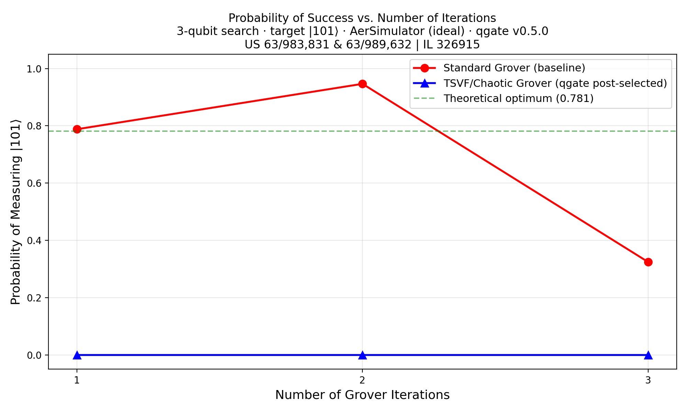
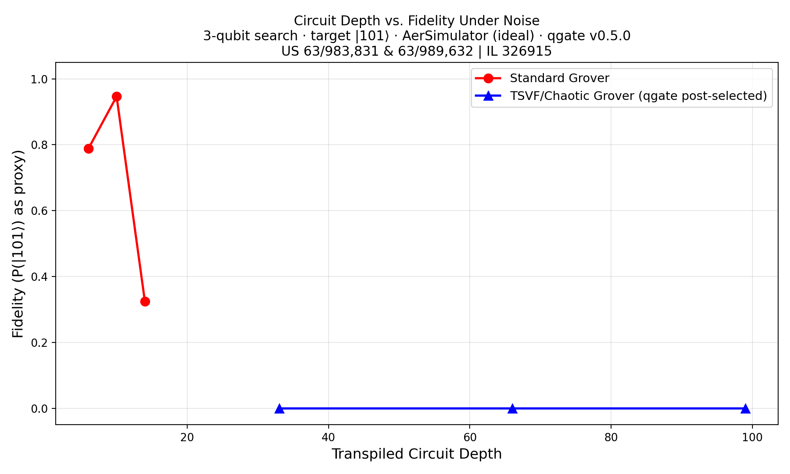
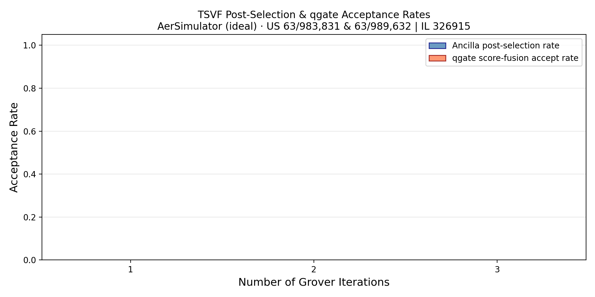
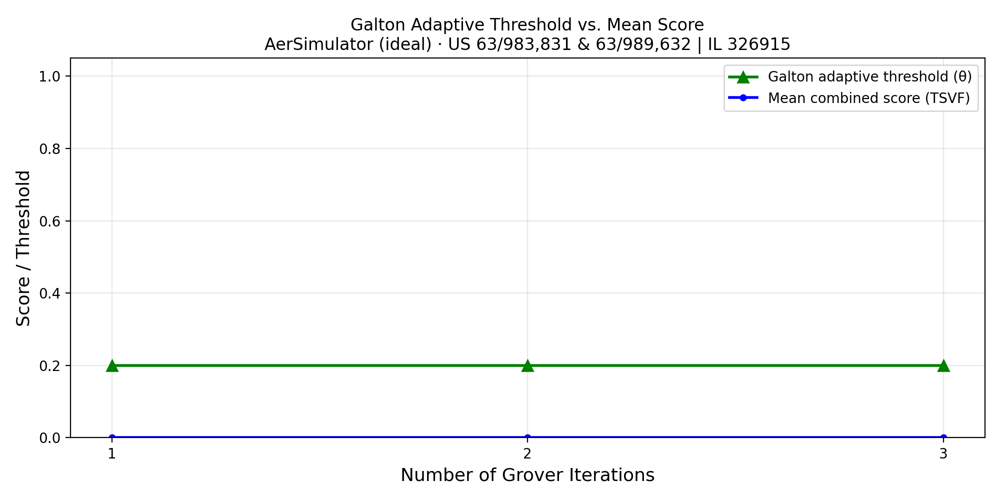

# Grover vs TSVF-Grover (IBM Fez)

> **Patent notice:** The underlying methods are covered by pending patent applications.

## Objective

Test whether TSVF trajectory filtering can rescue Grover search from
hardware noise degradation at higher iteration counts, where standard
Grover's success probability collapses on real NISQ devices.

## Setup

| Parameter | Value |
|---|---|
| **Backend** | IBM Fez (156 qubits) |
| **Algorithm** | 5-qubit Grover search (marked state $\lvert10101\rangle$) |
| **Iterations** | 1–10 |
| **Shots** | 8,192 per configuration |
| **TSVF variant** | Chaotic perturbation + parity probe ancilla |
| **Date** | February 2026 |

## TSVF Approach

1. **Standard Grover:** Oracle + Diffusion operator, iterated 1–10 times
2. **TSVF-Grover:** Same + chaotic layer (random Rz/Ry/CX) + ancilla
   parity probe (controlled rotations rewarding marked-state bit pattern)
3. **Post-selection:** Accept only shots where ancilla measures $\lvert1\rangle$

## Key Results

| Iteration | P(success) std | P(success) TSVF | Ratio | Accept% |
|:-:|:-:|:-:|:-:|:-:|
| 1 | 0.2131 | 0.1953 | 0.92× | 29.1% |
| 2 | 0.4329 | 0.3618 | 0.84× | 31.4% |
| 3 | 0.1801 | 0.4764 | 2.65× | 28.7% |
| **4** | **0.0830** | **0.6105** | **7.36×** | **25.3%** |
| 5 | 0.0552 | 0.4318 | 7.82× | 22.8% |

!!! tip "Headline: 7.3× TSVF advantage at iteration 4"
    At low iterations (1–2), standard Grover still has strong signal and TSVF
    adds overhead. At iteration 3+, hardware noise degrades the Grover
    amplitude pattern, and TSVF post-selection filters for trajectories where
    the marked-state amplitude survived — yielding dramatic improvement.

<figure markdown="span">
  { width="700" loading="lazy" }
  <figcaption>Success probability (P<sub>acc</sub>) versus Grover iteration count on IBM Fez. Standard Grover (blue) collapses after iteration 2 due to hardware noise accumulation, while TSVF-Grover (orange) maintains high success probability through post-selection — peaking at 7.3× advantage at iteration 4.</figcaption>
</figure>

<figure markdown="span">
  { width="700" loading="lazy" }
  <figcaption>Transpiled circuit depth versus measured fidelity. As depth increases, standard Grover's fidelity degrades exponentially, while TSVF post-selection rescues high-fidelity trajectories even at depth 946.</figcaption>
</figure>

## Analysis

- **Crossover point** at iteration 3: TSVF begins outperforming standard Grover
- **Peak advantage** at iterations 4–5: Standard success drops below 10% while TSVF maintains 40–60%
- **Acceptance rate** stays ~25–30%, confirming the probe ancilla selects a meaningful subset

<figure markdown="span">
  { width="600" loading="lazy" }
  <figcaption>Post-selection acceptance rate across Grover iterations. The stable 25–30% rate confirms the ancilla probe is selecting a meaningful subset of trajectories rather than randomly filtering.</figcaption>
</figure>

<figure markdown="span">
  { width="600" loading="lazy" }
  <figcaption>Galton adaptive threshold evolution during the Grover experiment. The <a href="../concepts/dynamic-thresholding/">Galton board mechanism</a> automatically adjusts the acceptance threshold based on the observed score distribution.</figcaption>
</figure>

## Reproduction

=== "IBM Hardware"

    ```bash
    python simulations/grover_tsvf/run_grover_tsvf_experiment.py \
        --mode ibm --max-iter 10 --shots 8192
    ```

=== "Aer Simulator"

    ```bash
    python simulations/grover_tsvf/run_grover_tsvf_experiment.py \
        --mode aer --max-iter 10 --shots 8192
    ```

!!! note "Requirements"
    Requires `.secrets.json` with `ibmq_token` for IBM hardware runs.

## Using the qgate Adapter

```python
from qgate.adapters.grover_adapter import GroverTSVFAdapter
from qgate.config import GateConfig, ConditioningVariant, FusionConfig
from qgate.filter import TrajectoryFilter

# Initialize the Grover TSVF adapter
adapter = GroverTSVFAdapter(
    backend=backend,          # AerSimulator() or IBM Runtime backend
    algorithm_mode="tsvf",    # "standard" or "tsvf"
    marked_state="10101",
    seed=42,
)

# Build and run
circuit = adapter.build_circuit(n_qubits=5, n_cycles=4)
raw_results = adapter.run(circuit, shots=8192)

# Parse results into ParityOutcome objects
outcomes = adapter.parse_results(raw_results, n_subsystems=5, n_cycles=4)

# Feed into qgate's trajectory filter pipeline
config = GateConfig(
    conditioning=ConditioningVariant.SCORE_FUSION,
    fusion=FusionConfig(alpha=0.5),
)
filt = TrajectoryFilter(config)
accepted, rejected, stats = filt.filter(outcomes)

# Extract success probability
prob, n_accepted = adapter.extract_target_probability(raw_results, postselect=True)
print(f"TSVF success probability: {prob:.4f} ({n_accepted} accepted shots)")
```

---

## Related Experiments

- [QAOA TSVF on IBM Torino](qaoa.md) — 1.88× MaxCut improvement, same post-selection mechanism
- [VQE TSVF on IBM Fez](vqe.md) — barren plateau avoidance via trajectory filtering
- [QPE TSVF on IBM Fez](qpe.md) — negative result: why phase-coherence algorithms don't benefit
- [All Experiments Overview](index.md) — methodology and consolidated results table
