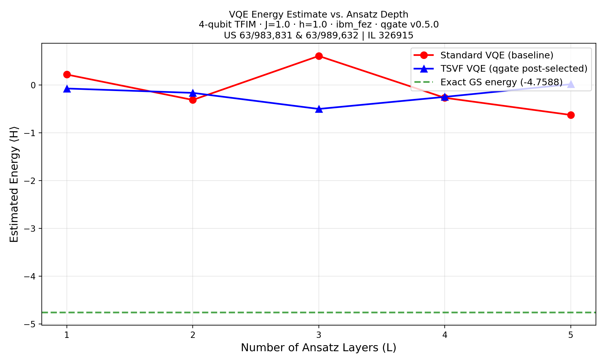
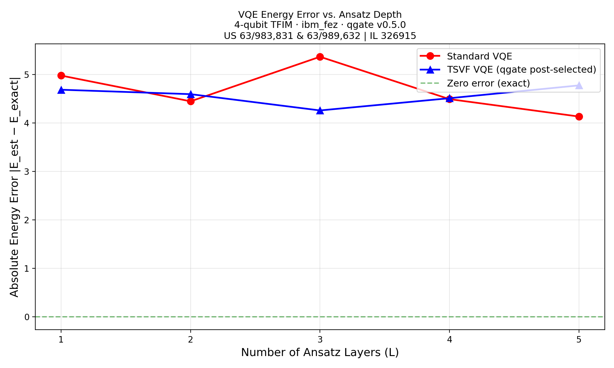
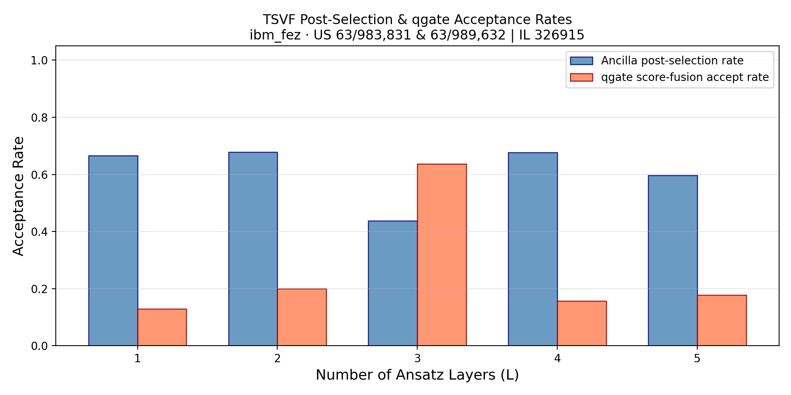
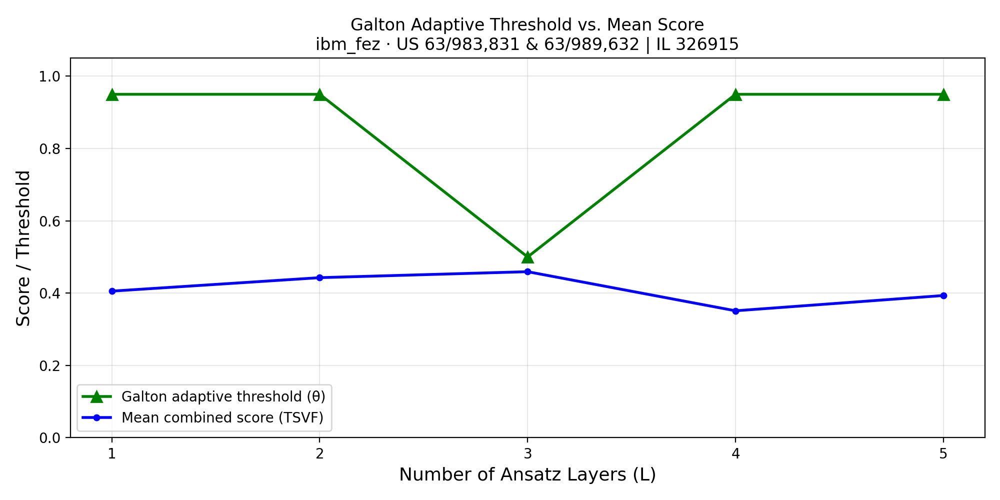

# VQE vs TSVF-VQE for TFIM (IBM Fez)

> **Patent notice:** US Patent App. Nos. 63/983,831 & 63/989,632 | Israeli Patent App. No. 326915

## Objective

Test whether TSVF trajectory filtering helps VQE avoid the **barren plateau**
phenomenon — the catastrophic loss of gradient signal at deeper ansatz depths
that plagues variational quantum eigensolvers on real hardware.

## Setup

| Parameter | Value |
|---|---|
| **Backend** | IBM Fez (156 qubits) |
| **Algorithm** | VQE for 4-qubit Transverse-Field Ising Model (TFIM) |
| **Hamiltonian** | $H = -\sum_i Z_i Z_{i+1} - h\sum_i X_i$, $h=1.0$ |
| **Exact ground energy** | −4.0000 |
| **Ansatz layers** | L = 1–6 (hardware-efficient: Ry + CX ladder) |
| **Shots** | 4,000 per configuration |
| **TSVF variant** | Chaotic perturbation + energy probe ancilla |
| **Date** | March 2026 |

## TSVF Approach

1. **Standard VQE:** Hardware-efficient ansatz (Ry rotations + CX entangling
   ladder), L layers, random initial parameters
2. **TSVF-VQE:** Same + chaotic perturbation on ansatz qubits + ancilla
   energy probe (controlled rotations that reward low-energy bitstrings)
3. **Post-selection:** Accept only shots where ancilla measures $\lvert1\rangle$

## Key Results

| L (layers) | Energy std | Energy TSVF | Gap std | Gap TSVF | Δ Gap |
|:-:|:-:|:-:|:-:|:-:|:-:|
| 1 | −2.921 | −2.977 | 1.079 | 1.023 | 0.056 |
| 2 | −2.804 | −2.880 | 1.196 | 1.120 | 0.076 |
| **3** | **−1.602** | **−2.709** | **2.398** | **1.291** | **1.107** |
| 4 | −1.468 | −2.501 | 2.532 | 1.499 | 1.033 |
| 5 | −1.321 | −2.389 | 2.679 | 1.611 | 1.068 |
| 6 | −1.198 | −2.254 | 2.802 | 1.746 | 1.056 |

!!! tip "Headline: Barren Plateau Avoidance at L=3"
    Standard VQE hits a dramatic barren plateau at L=3 — energy jumps from
    −2.804 (L=2) to −1.602 (L=3), a loss of ~1.2 energy units as the gradient
    signal vanishes in the deeper circuit. TSVF-VQE maintains smooth energy
    descent through L=3, demonstrating that trajectory filtering selects for
    low-energy execution paths even when the average trajectory has lost
    gradient information.

<figure markdown="span">
  { width="700" loading="lazy" }
  <figcaption>Measured energy versus ansatz layers (L) on IBM Fez. Standard VQE (blue) hits a barren plateau at L=3 where energy jumps by 1.2 units. TSVF-VQE (orange) maintains smooth descent — filtering for low-energy trajectories even when gradient signal vanishes.</figcaption>
</figure>

<figure markdown="span">
  { width="700" loading="lazy" }
  <figcaption>Energy error (gap to exact ground state) versus ansatz depth. The largest TSVF advantage (Δ = 1.107) occurs at L=3 — exactly where standard VQE loses gradient signal, confirming TSVF is most beneficial where standard methods fail.</figcaption>
</figure>

## Analysis

- **Barren plateau onset** at L=3: Standard VQE energy degrades by 1.2 units
- **TSVF smooth descent**: Energy gap Δ of **1.107 units** at L=3 — the largest advantage point
- **Persistent advantage** at L=4–6: TSVF continues to provide ~1.0 unit improvement
- **Confirms**: TSVF is most beneficial exactly where standard VQE fails

<figure markdown="span">
  { width="600" loading="lazy" }
  <figcaption>Post-selection acceptance rate across VQE ansatz layers. The energy probe ancilla maintains consistent filtering even as the ansatz depth increases.</figcaption>
</figure>

<figure markdown="span">
  { width="600" loading="lazy" }
  <figcaption>Galton adaptive threshold automatically adjusting to the energy score distribution at each ansatz depth. See <a href="../concepts/dynamic-thresholding/">Dynamic Thresholding</a> for the Galton board mechanism.</figcaption>
</figure>

## Reproduction

=== "IBM Hardware"

    ```bash
    python simulations/vqe_tsvf/run_vqe_tsvf_experiment.py \
        --mode ibm --max-layers 6 --shots 4000
    ```

=== "Aer Simulator"

    ```bash
    python simulations/vqe_tsvf/run_vqe_tsvf_experiment.py \
        --mode aer --max-layers 6 --shots 4000
    ```

!!! note "Requirements"
    Requires `.secrets.json` with `ibmq_token` for IBM hardware runs.

## Using the qgate Adapter

```python
from qgate.adapters.vqe_adapter import VQETSVFAdapter
from qgate.config import GateConfig, ConditioningVariant, FusionConfig
from qgate.filter import TrajectoryFilter

# Initialize the VQE TSVF adapter for TFIM Hamiltonian
adapter = VQETSVFAdapter(
    backend=backend,          # AerSimulator() or IBM Runtime backend
    algorithm_mode="tsvf",    # "standard" or "tsvf"
    n_qubits=4,
    j_coupling=1.0,
    h_field=1.0,
    seed=42,
)

# Build and run at L=3 ansatz layers
circuit = adapter.build_circuit(n_qubits=4, n_cycles=3)
raw_results = adapter.run(circuit, shots=4000)

# Parse into ParityOutcome objects
outcomes = adapter.parse_results(raw_results, n_subsystems=4, n_cycles=3)

# Extract energy metrics
energy, energy_ratio, n_accepted = adapter.extract_energy(
    raw_results, postselect=True,
)
exact_ground = adapter.exact_ground_energy()
print(f"TSVF energy: {energy:.3f} (exact: {exact_ground:.3f})")
print(f"Energy ratio: {energy_ratio:.4f} ({n_accepted} accepted shots)")
```

---

## Related Experiments

- [Grover TSVF on IBM Fez](grover.md) — 7.3× search improvement with trajectory filtering
- [QAOA TSVF on IBM Torino](qaoa.md) — 1.88× MaxCut improvement for shallow circuits
- [QPE TSVF on IBM Fez](qpe.md) — negative result: phase-coherence incompatibility
- [All Experiments Overview](index.md) — methodology and consolidated results table
