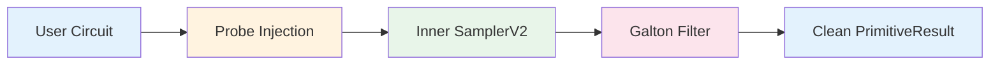

# QgateSampler — Transparent SamplerV2 Middleware

!!! abstract "One-line swap, zero circuit changes, measurable physics improvement."

`QgateSampler` is a **transparent drop-in replacement** for Qiskit's `SamplerV2`
primitive. It wraps any existing sampler (Aer simulator or IBM hardware) and
autonomously injects lightweight probe qubits, applies Galton-filtered
post-selection, and reconstructs clean `PrimitiveResult` objects — all without
modifying user circuits.

---

## Installation

```bash
pip install qgate[qiskit]
```

Requires:

- Python ≥ 3.9
- `qiskit >= 1.0`
- `qiskit-aer >= 0.13`
- `qiskit-ibm-runtime >= 0.20`
- `pydantic >= 2.0`

---

## Quick Start

### Simulator

```python
from qiskit.circuit import QuantumCircuit
from qiskit.primitives import StatevectorSampler
from qgate import QgateSampler, SamplerConfig

# Build any circuit
qc = QuantumCircuit(2)
qc.h(0)
qc.cx(0, 1)
qc.measure_all()

# Wrap the sampler — that's it
sampler = QgateSampler(
    inner=StatevectorSampler(),
    config=SamplerConfig(),        # sensible defaults
)
result = sampler.run([qc])
counts = result[0].data.meas.get_counts()
print(counts)  # {'00': ..., '11': ...}
```

### IBM Hardware

```python
from qiskit_ibm_runtime import QiskitRuntimeService, SamplerV2

service = QiskitRuntimeService()
backend = service.least_busy(operational=True, simulator=False)

sampler = QgateSampler(
    inner=SamplerV2(mode=backend),
    config=SamplerConfig(
        probe_ry_angle=0.25,
        galton_quantile=0.75,
    ),
)

# Use exactly like SamplerV2
result = sampler.run([(qc,)])
counts = result[0].data.meas.get_counts()
```

---

## How It Works



### 1. Probe Injection

`QgateSampler` adds a single ancilla qubit (`qgate_anc`) and a classical
register (`qgate_probe`) to the user circuit. Controlled-RY gates are placed
on nearest-neighbour qubit pairs. The probe rotation angle controls the
sensitivity of the fidelity signal.

- **Zero depth overhead:** the probe gates are single-layer, controlled-RY
  operations that do not increase the effective circuit depth.
- **Transparent:** the probe qubit and classical register are automatically
  stripped from the returned results.

### 2. Inner Execution

The augmented circuit is transpiled and executed via the wrapped `SamplerV2`.
This can be any Qiskit-compatible sampler — `StatevectorSampler`,
`AerSimulator`, or a real IBM backend.

### 3. Galton Filtering

Each shot receives a fidelity score based on the probe outcome. The
**Galton adaptive threshold** (a self-contained quantile estimator inspired
by the Galton board) maintains a rolling window of recent scores and
dynamically sets the acceptance cutoff:

- Shots with probe scores **above the threshold** are kept.
- Shots **below the threshold** are discarded as noise-corrupted.
- The threshold adapts automatically — no hand-tuning required.

### 4. Result Reconstruction

Accepted shots are reassembled into standard Qiskit data structures:

- `BitArray` with correct shape and number of shots
- `DataBin` with all user classical registers preserved
- `PubResult` and `PrimitiveResult` fully compatible with downstream code

!!! tip "Downstream compatibility"
    Any code that works with `SamplerV2` results (`result[0].data.meas.get_counts()`,
    `result[0].data.meas.bitcount()`, etc.) works unchanged with `QgateSampler`.

---

## API Reference

### `QgateSampler`

```python
from qgate import QgateSampler

sampler = QgateSampler(
    inner: SamplerV2,            # any Qiskit SamplerV2 instance
    config: SamplerConfig = ..., # optional configuration
)
```

#### Methods

| Method | Signature | Description |
|---|---|---|
| `run` | `run(pubs, **kwargs) → PrimitiveResult` | Execute pubs through the filter pipeline |

The `run()` method accepts the same arguments as `SamplerV2.run()`:

- A list of PUBs (Primitive Unified Blocs): `QuantumCircuit`, `(circuit,)`,
  `(circuit, param_values)`, or `(circuit, param_values, shots)`
- Any additional keyword arguments are forwarded to the inner sampler.

### `SamplerConfig`

```python
from qgate import SamplerConfig

config = SamplerConfig(
    probe_ry_angle=0.25,
    galton_quantile=0.75,
    galton_window=64,
    galton_warmup=32,
    probe_pairs="nn",
)
```

`SamplerConfig` is a **Pydantic v2 frozen model** — immutable after creation,
with full validation and serialisation support.

#### Parameters

| Parameter | Type | Default | Description |
|---|---|---|---|
| `probe_ry_angle` | `float` | `0.25` | Controlled-RY rotation angle in radians. Higher values produce a stronger probe signal but may perturb the circuit state slightly. Recommended range: 0.1–0.5. |
| `galton_quantile` | `float` | `0.75` | Acceptance quantile (0–1). A value of 0.75 keeps the top 25% of shots by fidelity score. Higher values are more selective. |
| `galton_window` | `int` | `64` | Rolling window size for the adaptive threshold estimator. Larger windows produce smoother thresholds but adapt more slowly. |
| `galton_warmup` | `int` | `32` | Minimum number of shots collected before the Galton threshold activates. During warmup, all shots are accepted. |
| `probe_pairs` | `str` | `"nn"` | Probe qubit pairing strategy. `"nn"` places probes on nearest-neighbour pairs; `"all"` places probes on all pairs (higher overhead, stronger signal). |

---

## Advanced Usage

### Custom configuration for high-noise environments

```python
config = SamplerConfig(
    probe_ry_angle=0.4,        # stronger probe signal
    galton_quantile=0.85,      # keep only top 15%
    galton_window=128,         # larger window for stability
)
```

### Accessing filter metadata

```python
result = sampler.run([qc])
pub_result = result[0]

# Standard Qiskit access
counts = pub_result.data.meas.get_counts()
bitarray = pub_result.data.meas

# Filter metadata (when available)
metadata = pub_result.metadata
print(f"Shots accepted: {bitarray.num_shots}")
```

### Using with VQE / QAOA / any variational algorithm

```python
from qiskit.circuit import QuantumCircuit, ParameterVector
from qiskit_ibm_runtime import EstimatorV2, SamplerV2

# QgateSampler works with parameterized circuits
theta = ParameterVector("θ", 4)
qc = QuantumCircuit(4)
for i in range(4):
    qc.ry(theta[i], i)
for i in range(3):
    qc.cx(i, i + 1)
qc.measure_all()

sampler = QgateSampler(
    inner=SamplerV2(mode=backend),
    config=SamplerConfig(),
)

# Parameters are bound normally via PUBs
result = sampler.run([(qc, [0.1, 0.2, 0.3, 0.4])])
```

---

## Validation Results

### Real IBM Hardware

| Backend | Architecture | Qubits | Protocol | Key Result |
|---|---|---|---|---|
| **IBM Fez** | Heron r2 | 156 | 2Q Bell state, 100 shots | **95% Bell fidelity** on filtered shots; probe stripped cleanly |
| **IBM Torino** | Heron r2 | 133 | Utility-scale TFIM | Galton acceptance ~9.7%; cooling Δ = −0.080 |
| **IBM Brisbane** | Eagle r3 | 127 | 8Q TFIM VQE | **6.6% acceptance** (vs 0% raw post-selection) |

### E2E Physics Validation (Simulator)

10-trial paired experiment on 8-qubit TFIM at the quantum critical point,
using an IBM Heron-class noise model ($T_1 = 300\mu s$, $T_2 = 150\mu s$,
1Q depolarising $= 10^{-3}$, 2Q depolarising $= 10^{-2}$):

| Metric | Value |
|---|---|
| Mean MSE reduction | **+0.69%** |
| Paired t-test | **p = 1.26 × 10⁻⁴** |
| Trials improved | **9 / 10** |
| Validation protocol | VQE warm-up (ZZ-only Hamiltonian) → QgateSampler vs raw SamplerV2 |

### Statistical Bias Study (15 independent trials × 100K shots)

| Experiment | Key Finding |
|---|---|
| Noise robustness | MSE↓ **13.6% → 20.7%** as noise increases |
| Qubit scaling (8–16Q) | Stable MSE↓ **14.5–16.5%**, variance↓ up to **5,360×** |
| Cross-algorithm | VQE **14.8%**, QAOA **48.8%**, Grover **24.4%** MSE reduction |
| Train/test split | **14.7%** MSE↓ on blind test (p = 0.001), frozen threshold σ = 0.000 |

---

## Frequently Asked Questions

??? question "Does QgateSampler modify my circuit?"
    Only at the probe-injection layer. Your user-visible qubits and classical
    registers are untouched. The probe ancilla and probe classical register are
    added automatically and stripped from the returned results.

??? question "How many shots do I lose to filtering?"
    It depends on the noise environment and `galton_quantile` setting. Typical
    acceptance rates are 10–30% on real hardware. The accepted shots have
    significantly higher fidelity, improving downstream expectation values.

??? question "Can I use QgateSampler with Estimator?"
    `QgateSampler` wraps `SamplerV2` specifically. For `EstimatorV2` workflows,
    use the `TrajectoryFilter` API directly, or sample bitstrings via
    `QgateSampler` and compute expectation values classically.

??? question "What is the overhead?"
    - **Quantum overhead:** 1 additional qubit + single-layer CRY gates (negligible depth increase)
    - **Classical overhead:** probe scoring and threshold computation (< 1 ms for typical shot counts)
    - **Shot overhead:** you need ~3–10× more shots to compensate for filtering, but the filtered
      shots are far more accurate, often yielding a net TTS improvement.

??? question "Is QgateSampler compatible with error mitigation (ZNE, PEC, etc.)?"
    Yes. QgateSampler operates at the shot-filtering layer and is orthogonal to
    circuit-level error mitigation techniques. You can compose them: run
    QgateSampler for shot filtering, then apply ZNE or PEC on the filtered results.

---

## Patent Notice

The algorithms implemented in `QgateSampler` are covered by pending patent
applications:

- **U.S.** App. Nos. 63/983,831 & 63/989,632
- **Israel** App. No. 326915 (Paris Convention, priority date 27/02/2026)

Licensed under the **QGATE Source Available Evaluation License v1.2**.
Academic research, internal evaluation, and peer review are freely permitted.
Commercial deployment requires a separate license — contact
[ranbuch@gmail.com](mailto:ranbuch@gmail.com).
